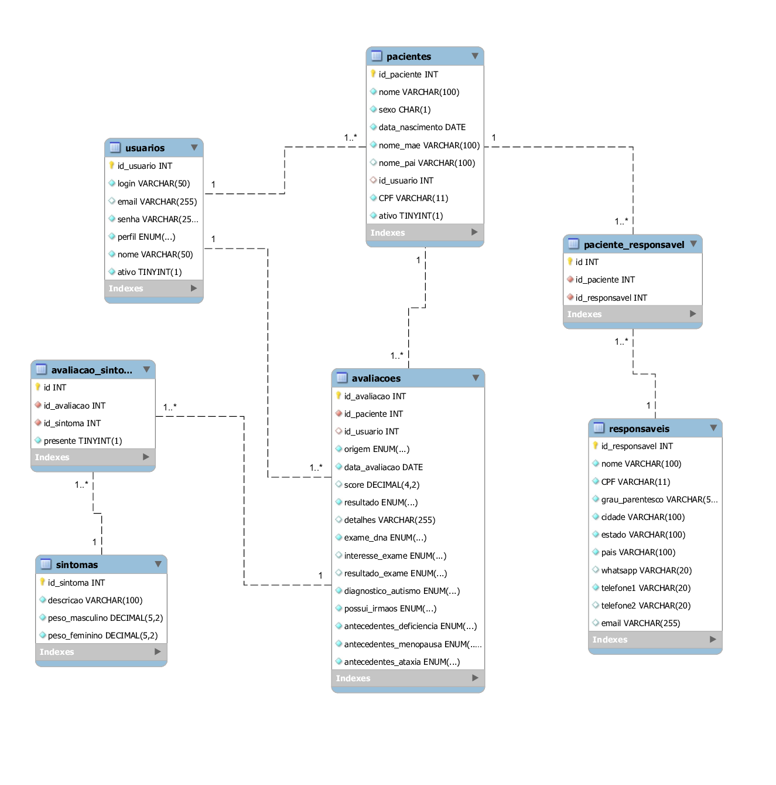

# AvaliaX

Sistema de avaliação clínica voltado para apoiar profissionais de saúde na análise de pacientes com suspeita de condições relacionadas ao **X-Frágil**.  
Permite cadastro de pacientes, realização de avaliações estruturadas e geração de relatórios individuais e gerais.

---

## Funcionalidades

- **Cadastro de pacientes**
  - Profissionais podem cadastrar, atualizar e desativar pacientes.
  - Usuários administradores podem consultar todos os pacientes; usuários comuns apenas os próprios.
  - Responsáveis podem realizar **autocadastro** sem autenticação, mas não possuem privilégios de um profissional de saúde.

- **Cadastro de usuários**
  - Usuários administradores podem criar novos profissionais de saúde e gerenciar contas.

- **Realização de avaliações**
  - Questionário objetivo sobre histórico e sintomas.
  - Cálculo automático de **score** com base em pesos definidos por artigo científico.
  - Resultado: **TESTE INDICADO** ou **INCONCLUSIVO**.
  - Observações clínicas opcionais para contextualização.

- **Relatórios**
  - Relatórios gerais: estatísticas globais, média de score, porcentagem de resultados, ranking de sintomas.
  - Relatórios individuais: dados básicos do paciente, últimas avaliações, sintomas mais recorrentes.
  - Exportação em PDF ou impressão direta.

---

## Tecnologias Utilizadas

- **Front-end:** HTML5, CSS3, JavaScript (REST API).
   
- **Back-end:** Java 21 (Spring Boot 3.x).
  
- **Banco de Dados:** MySQL 8.x.

- **ORM:** Hibernate (Spring Data JPA).

- **Migrações:** Flyway (scripts versionados).

- **Controle de versão:** GitHub/Git.

- **Ferramentas adicionais:** Maven, Visual Studio Code (Live Server para front).  

---

## Requisitos de Sistema

- Windows 10/11 ou Linux (Ubuntu 20.04+).

- JDK 21 ou superior.

- Visual Studio Code com extensão Live Server;

- MySQL instalado previamente.

- Git (opcional, recomendado).

- Maven (obrigatório).  

---

## Entidades do Banco de Dados

O banco de dados do AvaliaX foi projetado para suportar avaliações clínicas e o gerenciamento de pacientes, responsáveis e usuários. Abaixo estão as principais entidades:

- **Pacientes**  
  Armazena informações pessoais dos pacientes, como nome, sexo, data de nascimento, CPF e entre outros dados.

- **Usuários**  
  Representa os usuários do sistema (administradores e comuns), contendo login, senha, perfil de acesso e status ativo.

- **Responsáveis**  
  Contém dados dos responsáveis legais pelos pacientes, incluindo nome, CPF, grau de parentesco, cidade, estado e meios de contato (telefone, e-mail, WhatsApp).

- **Paciente_Responsável**  
  Tabela de relacionamento que vincula pacientes aos seus respectivos responsáveis.

- **Avaliações**  
  Registra cada avaliação realizada, com informações como data, origem, resultado, score e detalhes adicionais.

- **Avaliação_Sintomas**  
  Relaciona as avaliações com os sintomas observados em cada paciente.

- **Sintomas**  
  Lista de sintomas cadastrados, com descrição e pesos diferenciados por sexo, permitindo análises mais precisas.

- **Flyway_Schema_History**  
  Controla o histórico de migrações do banco de dados, garantindo versionamento e consistência das alterações estruturais.

### Diagrama Entidade-Relacionamento

O modelo lógico do banco de dados AvaliaX pode ser visualizado no diagrama abaixo.  
Ele mostra as principais entidades (Pacientes, Usuários, Responsáveis, Avaliações, Sintomas, etc.) e seus relacionamentos.



---

## Preparação do Banco de Dados

O sistema utiliza **migrações automáticas com Flyway**, mas é necessário criar manualmente o banco vazio antes da primeira execução:

### Passos:

1. Clone o repositório: `git clone https://github.com/NauaWK/AvaliaX.git`
2. Crie o banco: `CREATE DATABASE avaliax;`
3. Configure as variáveis de ambiente necessárias para execução:
```
DB_URL=jdbc:mysql://localhost:3306/avaliax
DB_USER=avaliax_user
DB_PASS=senha_do_usuario
```
→ Ajuste porta, nome do banco e credenciais conforme sua configuração.

---

## Instalação e Execução

### Backend (servidor)

1. Entre na pasta do servidor: `cd server`
2. Compile o projeto com Maven: `mvn clean install`
3. Execute o artefato gerado: `java -jar target/xfragil-0.0.1-SNAPSHOT.jar`
4. Alternativamente, execute diretamente: `mvn spring-boot:run`

### Frontend

1. Abra a pasta `front` no Visual Studio Code.
2. Com a extensão Live Server instalada, clique em Go Live para iniciar.

---

## Usuários Pré-inseridos
O sistema já possui dois usuários cadastrados via migrações SQL:

→ Admin
```
Login: admin
Senha: admin12345-
```
→ Usuário Comum
```
Login: user
Senha: user12345-
```
